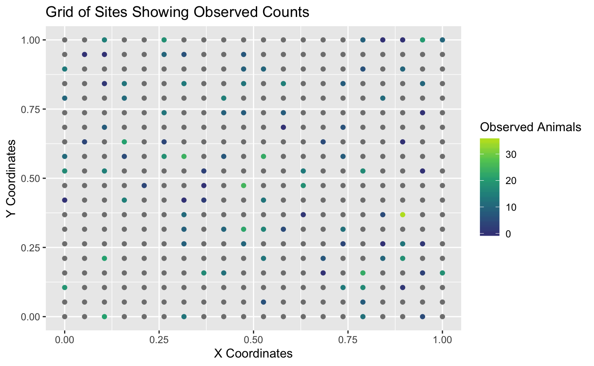

<!-- README.md is generated from README.Rmd. Please edit that file -->
FPBKPack2
=========

The goal of FPBKPack2 is to predict a population total when

1.  There are a finite number of sites in a region of interest.
2.  Not all of the sites are sampled.
3.  There might be imperfect detection of units on the sites that are sampled.
4.  There is spatial autocorrelation among the counts.

Note that the estimator is called the *GSPE* (Geo-Spatial Population Estimator) by many biologists in Alaska and Canada. Throughout the website and package documentation, *FPBK* (Finite Population Block Kriging) estimator and the *GSPE* are used interchangeably. Both refer to the same prediction process.

Installation
------------

You can install the FPBKPack2 from [GitHub](https://github.com/highamm/FPBKPack2) with:

``` r
devtools::install_git("https://github.com/highamm/FPBKPack2.git")
```

Basic Example
-------------

The following example shows how to predict the counts on unsampled sites in a simulated data set. See the `Using the GSPE R Package` vignette under "Articles" for a more detailed description of how to use the package.

The plot below shows that only some of the sites were sampled. In this simulated example, the counts represent moose. The remaining sites that were not sampled do not have observed moose counts. In the plot below, sites without observed counts are coloured grey.



We can also examine the first six observations of the data set with the observed counts:

``` r
knitr::kable(head(basicdf))
```

|    X|    Xcoords|    Ycoords|  Moose|  CountPred|   DetPred1|    DetPred2| Stratum |  Area|
|----:|----------:|----------:|------:|----------:|----------:|-----------:|:--------|-----:|
|  127|  0.3157895|  0.3157895|      9|   4.302138|  0.0421800|  -0.7164407| Low     |     2|
|   76|  0.7894737|  0.1578947|     23|   1.901080|  0.9236562|   1.6464221| Low     |     2|
|   78|  0.8947368|  0.1578947|     NA|   2.507180|  0.2561130|  -0.0964677| Low     |     2|
|   20|  1.0000000|  0.0000000|     NA|   2.521382|  0.3524129|  -1.8202738| Low     |     2|
|  219|  0.9473684|  0.5263158|      0|   3.692670|  0.0645832|   0.8484421| Low     |     2|
|   48|  0.3684211|  0.1052632|     NA|   3.086353|  0.4623587|  -1.1950225| High    |     2|

Note that any site that does not have an observed moose count has an `NA` value in the `Moose` column.

To predict the counts on the unobserved sites, we fit a spatial linear model (`slmfit`), use finite population block kriging to predict counts on the unobserved sites from the linear model (`predict`), obtain summary output (`FPBKoutput`), and obtain a data set with sitewise predictions and an HTML summary report (`get_reportdoc`).

``` r
slmobj <- slmfit(formula = Moose ~ Stratum,
  data = basicdf,
  xcoordcol = "Xcoords",
  ycoordcol = "Ycoords")
predobj <- predict(object = slmobj)
outputobj <- FPBKoutput(pred_info = predobj)

pred_df <- outputobj$predvals
get_reportdoc(outputobj)
```

We can also incorporate imperfect detection by adding a couple of extra arguments (see Sections 2 and 3 of the Article `Using the GSPE R Package`). The Article also has information on other options to the functions, such as specifying a specific region to predict, fitting separate covariance models for each stratum, etc.

Finally, the Article `Using the GSPE Shiny App` gives directions on how to upload data and then use the package with a `Shiny` interface.
