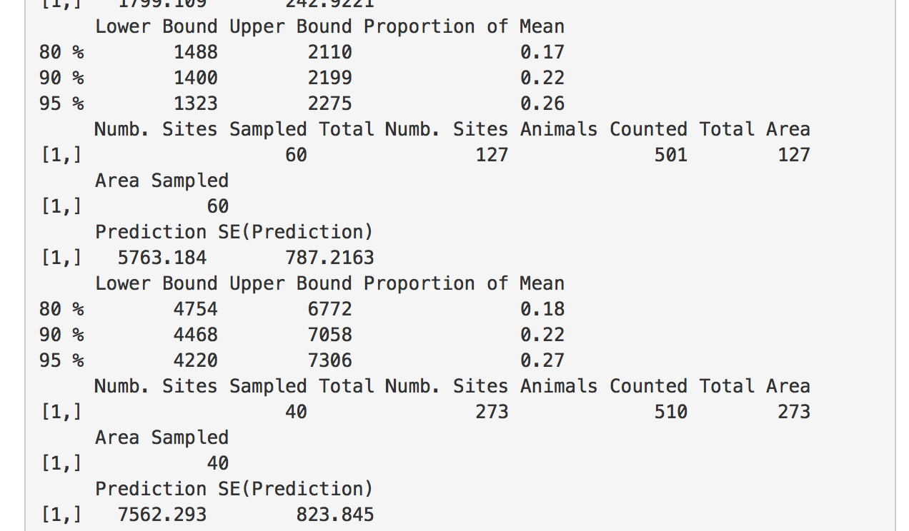

```{r setup2, include = FALSE}
knitr::opts_chunk$set(
  collapse = TRUE,
  comment = "#>",
  echo = FALSE
)
```


## Introduction

The purpose of this vignette is to illustrate how to use the GSPE `R Shiny` app for moose survey data, both with and without a separate sightability study. There are three primary sections, each building off the previous section. Throughout the Vignette, we will use simulated data that is similar to a survey and sightability trials in March 2017 at the Togiak National Wildlife Refuge. Note, however, that the data and locations are altered for privacy. Though some of the documentation references moose specifically, the app can be used for many ecological studies with count data collected on a finite number of sites.

- Section 1 shows how to obtain a population prediction assuming perfect detection.
- Section 2 shows how to obtain a population prediction assuming constant detection across all sites. This requires the user to have an estimate for mean detection with a standard error.
- Section 3 shows how to obtain a population prediction using radiocollar data with the possibility of site covariates useful for predicting detection. This requires the user to have a separate data set with sightability trials using radiocollared animals.

If using the app for the first time, we recommend making sure that the steps in Section 1 work first before trying to add sightability to the model. Before looking at the `Shiny` app, let's first examine the example data set we will be using.

To cite the package, run the following lines:

```{r, echo=TRUE, warning=FALSE, results = "asis", eval=FALSE}
## install the package first with devtools
## devtools::install_git("https://github.com/highamm/FPBKPack2.git")
library(FPBKPack2)
citation("FPBKPack2")
```

_____________________________________

## Example Data

As mentioned above, we will use an example data set to illustrate how to use the `Shiny` app. If desired, one can download the example data set from INSERT URL HERE and follow along. Though we have sightability trials for this particular data set, suppose first that we want to assume perfect detection. Like many moose data sets, the the sites in our example data set are stratified into a "High" stratum and a "Low" stratum. Let's take a look at the data set.

```{r, eval = FALSE, echo = FALSE, include = FALSE}
set.seed(21214)
detpredictor1 <- runif(50, 0, 1)
detpredictor2 <- runif(50, -2, 2)

beta0 <- 1; beta1 <- 0.5; beta2 <- 0.25

detectionvar <- rbinom(50, 1,
  exp(beta0 + beta1 * detpredictor1 + beta2 * detpredictor2) / 
  (1 + exp(beta0 + beta1 * detpredictor1 + beta2 * detpredictor2)))

radiocollartab <- cbind(detectionvar, detpredictor1, detpredictor2)
radiocollardataset <- data.frame(radiocollartab)
colnames(radiocollardataset) <- c("Detected", "DetPred1", 
  "DetPred2")
write.csv(radiocollardataset, "vignettedetection.csv")

ncount <- 400
xcoords <- seq(0, 1, length.out = round(sqrt(ncount)))
ycoords <- seq(0, 1, length.out = round(sqrt(ncount)))
allcoords.grid <- expand.grid(xcoords, ycoords)

Sigmat.All <- matrix(NA, nrow = ncount, ncol = ncount)

countpredictor1 <- rnorm(ncount, 4, 2)
beta0count <- -2
beta1count <- -0.5

beta0count + beta1count * countpredictor1
countpredictorstrat <- factor(sample(c("High", "Low"), size = ncount,
  prob = c(0.3, 0.7), replace = TRUE))
beta2count <- 9

Xdes <-  matrix(cbind(rep(1, times = ncount),
  countpredictor1, countpredictorstrat), ncol = 3)
mu <- Xdes %*% matrix(c(beta0count, beta1count, beta2count))

dismat.all <- as.matrix(stats::dist(as.matrix(allcoords.grid),
  diag = TRUE, upper = TRUE))
parsil <- 50; nugget <- 70; range <- 1

Sigmat.All <- parsil * exp(-dismat.all / range)
Sigmat.All2 <- as.matrix(diag(nugget, nrow = nrow(Sigmat.All))) +
    as.matrix(Sigmat.All)

Dchol <- chol(Sigmat.All2)

## use cholesky decomposition to generate counts
z <- as.vector(round(mu + t(Dchol) %*% rnorm(ncount)))
z
## assign any negative counts to 0
z[z < 0] <- 0
moose <- z

detpredictorall1 <- runif(ncount, 0, 1)
detpredictorall2 <- runif(ncount, -2, 2)

truedetprobs <- exp(beta0 + beta1 * detpredictorall1 +
    beta2 * detpredictorall2) / 
  (1 + exp(beta0 + beta1 * detpredictorall1 +
      beta2 * detpredictorall2))
obscounts <- rbinom(moose, size = moose, prob = truedetprobs)

countdf <- data.frame(allcoords.grid, obscounts, countpredictor1,
  detpredictorall1, detpredictorall2, countpredictorstrat)
reorderindx <- sample(1:ncount, size = ncount, replace = FALSE)
countdf$areavar <- rep(2, ncount)

countdford <- countdf[reorderindx, ]
colnames(countdford) <- c("Xcoords", "Ycoords", "Moose", "CountPred",
  "DetPred1", "DetPred2", "Stratum", "Area")
sampledsiteindx <- c(sample(which(countdford$Stratum == "High"), size = 60, replace = FALSE), sample(which(countdford$Stratum == "Low"), size = 40, replace = FALSE))
countdford$Moose
countdford$Moose[-sampledsiteindx] <- NA

write.csv(countdford, "vignettecount.csv")
```

```{r, echo = FALSE}
library(FPBKPack2)
simdf <- vignettecount
pander::pander(head(simdf[ ,c("Xcoords", "Ycoords", "Moose",
  "CountPred", "Stratum")]))
```

The data table shows the first six observations of our data set. The first two columns represent spatial x and y coordinates for the centroids of each site, the next column `Moose` is the observed number of moose on each site with an `NA` value for any site that is not sampled, `CountPred` is a continuous predictor for the abundance of moose on each site (like some habitat covariate), and `Stratum` is the pre-survey stratification scheme into `High` and `Low` strata. 

_Note_: Both the `R` package and the `Shiny` app assume that any site that is not sampled has `NA` for the column with the count. If data are input into Excel and unsampled sites have blank cells for the `Moose` column, then `R` and `Shiny` will automatically populate the blank cells with `NA`'s. So, unsampled sites should have `NA` or blank count values (not `-9999` or `NotSampled`, etc.) before using the `Shiny` app.

We might also want to look at a grid to see where our sampled sites are.

```{r, echo=FALSE, fig.height=4, fig.width=6}
minxdist <- min(dist(simdf$Xcoords)[dist(simdf$Ycoords) != 0])
minydist <- min(dist(simdf$Xcoords)[dist(simdf$Ycoords) != 0])
simdf$sampind <- factor(is.na(simdf$Moose))
levels(simdf$sampind)[1] <- "Sampled"
levels(simdf$sampind)[2] <- "Unsampled"

p3 <- ggplot2::ggplot(data = simdf,
  ggplot2::aes(x = Xcoords, y = Ycoords,
  colour = as.factor(sampind))) +
  ggplot2::scale_colour_viridis_d("Sampling Indicator", begin = 0.2,
    end = 0.9) +
  ggplot2::geom_point() +
  ggplot2::xlab("X Coordinates") + ggplot2::ylab("Y Coordinates") +
  ggplot2::ggtitle("Grid of Sites Showing Which Were Sampled")
print(p3)
```

We can also look at a grid showing which sites were stratified into the high stratum and which were stratified into the low stratum.

```{r, echo=FALSE, fig.height=4, fig.width=6}
stratgrid <- ggplot2::ggplot(data = simdf,
  ggplot2::aes(x = Xcoords, y = Ycoords,
  colour = Stratum)) +
  ggplot2::scale_colour_viridis_d("Stratum", begin = 0.2,
    end = 0.9) +
  ggplot2::geom_point() +
  ggplot2::xlab("X Coordinates") + ggplot2::ylab("Y Coordinates") +
  ggplot2::ggtitle("Grid of Sites Showing How Sites Were Stratified")
print(stratgrid)
```

_____________________________________

## Section 1: Assuming Perfect Detection

#### Step 1: Load the `Shiny` app.

You will need to open `R` or `RStudio` on your personal desktop and run the following lines of code:

```{r, echo=TRUE, eval=TRUE, warning=FALSE, message=FALSE}
## will also need to install the shiny package 
## and the shinyFiles package if you have not done 
## so ever before on your current machine.

## You only need to install the packages once. Uncomment the lines
## by deleting the two hashtags.
## install.packages("shiny")
## install.packages("shinyFiles")
##library(shiny)
```

```{r, echo=TRUE, eval=FALSE}
## install the R Package here
devtools::install_git("https://github.com/highamm/FPBKPack2.git")
```

This installs the `R` package needed to run the `Shiny` app. Next, we will copy the files that generate the `Shiny` app onto your personal computer. You may want to modify the `destdir` argument so that the code creates a folder at a different location of your computer. Currently, running the line of code will create a folder titled "appfolder" on my Desktop.

```{r, echo=TRUE, eval=FALSE}
## running this line should open a web browser with the Shiny app.
runGitHub("Shiny-FPBK", "highamm", destdir = "~/Desktop/appfolder",
  launch.browser = TRUE)
```

If all goes well, you should see something pop up in your browser like this:

The major advantage of using this function is that it is portable in the sense that it works for all document formats that knitr supports, so you do not need to think if you have to use, for example, LaTeX or Markdown syntax, to embed an external image. Chunk options related to graphics output that work for normal R plots also work for these images, such as out.width and out.height.

Example:

```{r, out.width = "700px"}
knitr::include_graphics("Shinystart.png")
```

Let's first assume that we have perfect sightability. Then, in the `Shiny` app, we can completely ignore the "Radiocollar Sightability" tab and focus only on the "GSPE" tab. 

_____________________________________

#### Step 2: Upload Your Data

Your data should be in a .csv file. Click the Browse button on the `Shiny` app, finding your .csv file on your local computer. After uploading the data set, you should see a header of the data with the first 6 lines of your .csv file pop up on the main window of the app. Looking at the first 6 lines is a nice way to verify that your data has uploaded correctly.

_Tip_: If you have a lot of extra variables in your .csv file, the `Shiny` app will generally be harder to work with. For example, each variable will be a candidate predictor for the total count so there will be a ton of checkboxes under the `Select Predictors` heading. You might want to consider saving a version of the data with only what you will need in the app (counts, site ID numbers, coordinates, relevant predictors, stratification column, etc.) and get rid of unnecessary columns (notes, for example).

If all goes well, you should see a header of your data appear, as in

```{r, out.width = "700px"}

```

<!--  -->

_____________________________________

#### Step 3: Change the App Inputs

Next, we need to tell the `Shiny` app which column in our data has the counts, which columns have covariates for predicting the response (if any), which column has the stratification variable, and which columns have the spatial X and Y coordinates. If the X and Y coordinates are in Latitude and Longitude format, then we also would need to check the box indicating that the coordinates are in that format. The `Shiny` app converts Lat/Lon coordinates to TM coordinates for spatial prediction. 

_Note_: When including stratification, there are two options:

1. Stratum can be selected under the `Stratification column` drop-down menu. This option is what the Winfonet application does, fitting separate covariance models for each stratum. If the high stratum has more variability than the low stratum (which is usually the case), this is the option you would want to select.

2. Stratum can be chosen as a predictor under `Predictors`. This fits the same covariance model to both stratum, but lets the stratum have different means.

Stratum should only be entered using option 1 or option 2, but __not__ both. 

There are a few extra optional arguments to check. If the areas of your sites are different, then you can choose the name of your `Area` column within the app. The other arguments have to do with detection so we will skip those for now. Once you have chosen everything, click the __Submit__ button near the bottom of the webpage. If everything is okay, you should see some `R` output in the main panel of the app. If not, make sure all of the inputs are specifying the correct columns and then click the __Submit__ button again.

The following is what is obtained using the sample data set, with `Moose` as the response, `CountPred` as a predictor (make sure to uncheck None!), `Xcoords` as the x-coordinate column, `Ycoords` as the y-coordinate column, and `Stratum` as the Stratification column.

```{r, out.width = "700px"}

```

<!--  -->

We see that the predicted total is about 4540 moose for the entire region.

_____________________________________

#### Step 4: Get a Report and a Data Frame with Site-by-site Predictions

The `R` output in the main panel is not "pretty" and really only serves as a check to make sure everything went okay with the uploaded data. The __Get Report__ button will generate a nice-looking report while the __Get_Prediction_Data__ button will generate a .csv file with the original data as well as site-by-site predictions and a few other appended columns. The report and prediction data set will be in the folder that you made in the very first step using the `runGitHub` function. The report is in HTML format with a title "report.date_of_today.html". The data set is named "predictions.csv". 

_____________________________________

## Section 2: Assuming Constant Detection

Depending on the study region, it might be reasonable to assume that detection is constant across the region of interest. That is, though detection is not perfect, sightability issues are about the same no matter which site we are at. 

If this is the case, repeat the steps of Section 1 with a few minor modifications to __Step 3__. Now, choose an estimated mean detection between 0 and 1 and enter this value in the __Enter Estimated Detection__ input box. Also, enter a standard error for the estimated mean detection in the __Enter Standard Error for Detection__ input box. 

If you are using radiocollar data without any predictors for detection, the estimated detection and associated standard error can be found using the following `R` code.

```{r, echo=TRUE, eval=FALSE}
X <- enter_number_of_sighted_moose
n <- enter_number_of_radiocollar_trials

p_hat <- X / n
SE <- sqrt(p_hat * (1 - p_hat) / n)

p_hat
SE
```

After clicking the submit button, proceed to Step 4. The predicted total in the Report should be higher when entering in an estimated detection than when assuming that the detection probability is equal to 1. 

For the same dataset in the perfect detection section and an estimated detection of 0.6 with a standard error of 0.04, you should obtain output similar to the following, with a prediction for the total number of moose around 7500 (which makes sense, given that our predicted total assuming perfect detection was about 4500: $\frac{4500}{0.6} \approx 7500$).

```{r, out.width = "700px"}

```

<!--  -->

The Report and Prediction Data set can then be generated by clicking the "Get Report" and "Get Prediction Data" tabs, respectively.

_____________________________________

## Section 3: Non-constant Detection with Radiocollar Data

If we have radiocollar data, then we can incorporate this type of sightability data into the prediction for a population total (or some other prediction). We will follow the same structure of Steps as in Section 1, with a couple of changes.

_____________________________________

####Step 1.5: Upload your Sightability Data and Select App Inputs

* After loading the `Shiny` app, but before uploading your count data set, click the __Radiocollar Sightability__ tab. 

* Select "Browse" and choose your .csv file with the sightability data.

* The detection column should be a column of 1's and 0's, with a 1 denoting an animal that was successfully sighted and a 0 denoting an animal that was not successfully sighted.

* If there are covariates useful for predicting detection, select these predictors from the __Detection Predictors__ checkboxes. 

* Click __Submit__. If all goes well, you should see some `R` output in the main panel of the `Shiny` app.

* Without closing the `Shiny` app, click the __GSPE__ tab and proceed with steps 2-4 of Section 1.

* \emph{Note}: When inputting information on the __GSPE__ tab, it is important to not change the Mean Detection or Standard Error for Detection inputs. Changing these essentially results in double counting for imperfect detection (one adjustment is made using the radiocollar data and then a second adjustment is made using the mean detection).

* \emph{Note}: If you have predictors for detection in the radiocollar sightability data set, the count data set must also have columns with these predictors, __with the same exact names__ (and `R` is case sensitive!). For example, if I have a predictor called `prop_of_birch` in the radiocollar data set, then I must have a column titled `prop_of_birch` in the count data set that has the Proportion of Birch at all of the sites.

If using the example data sets, `vignettecount.csv` and `vignettedetection.csv`, you should obtain output similar to the following when using the Radiocollar Sightability tab with `Detected` as the response and `DetPred1` and `DetPred2` as predictors:

```{r, out.width = "700px"}

```

<!--  -->

If you are familiar with logistic regression, then you can interpret the coefficient estimates, `coefs`.

Then, after uploading the `vignettecount.csv` file in the GSPE tab and inputting the same variables for the counts, coordinates, count predictors (`CountPred`), and stratification that we did in Section 1, you should obtain the following output:

```{r, out.width = "700px"}

```

<!--  -->

_Note_: There are two kinds of predictors that the app can handle: predictors for detection and predictors for the count total. Predictors for detection go in the "Radiocollar" tab while predictors for counts go in the "GSPE" tab. 

_____________________________________

## Extra Inputs

* `Area`: if your sites have differing areas, then choose the column with your site areas in the "Area" input of the `Shiny` app. Internally, the `R` package will convert your areas to densities, predict densities at all of the sites, and then transform the densities back to count predictions at the end. Therefore, the regression coefficients, covariance parameter estimates, etc. that appear in the `Shiny` app output will be for densities so don't worry if they seem different than what you would expect for your count data.

* `Latitude / Longitude?`: There is an option to indicate that your x and y coordinates are in longitude / latitude form. If checked, the package will convert the coordinates into Trans-Mercator form (TM), which is more appropriate for kriging.

* `Prediction Weight Column`: If you would like to predict something other than the total number in your region of interest, then you need to put the prediction weights into the prediction weight column. The most common need for this might be to predict the total number of moose in a game management unit (GMU). Then, the prediction weight column should have a `1` for any observation within the GMU of interest and a `0` for any observation not within the GMU of interest.

_____________________________________

##### `Map with Shapefile`

Finally, the grid or predictions in the HTML output is only a scatterplot coloured by the predicted values with different shapes for whether or not a site was sampled. The .csv file that is uploaded with the prediction data does not have the spatial information necessary to make a more complete map of the predictions. If you have a shapefile along with its associate files (.shp, .dbf, .shx, and .prj) along with the data set with predictions generated from the "Get Prediction Data" button, you can upload both sets of files in the Map with Shapefile tab. 

What is crucial is that there is an ID number in the shapefile that matches ID numbers in the prediction data set. The common site ID numbers is how the `Shiny` app merges the two data sets so that the predictions go to the correct sites. 

_Note_: When uploading the .shp, .dbf, .shx, and .prj files, you must upload all of the files at the __same__ time.

Select the matching ID columns in the shapefile and in the prediction data set as well as the column with the predictions and then click the Submit button. If successful, a map should appear in the `Shiny` browser window. The map will automatically be saved in the folder you created in the Section 1 `runGitHub` step.

ALternatively, you can also make the map yourself using GIS software, Python, or some other software because the prediction data set is always output to a .csv file.

```{r, echo = FALSE, eval = FALSE}
library(devtools)
devtools::install_git("https://github.com/highamm/FPBKPack2.git")
library(FPBKPack2)
marchlowsamp <- read.csv("~/Desktop/BayesianCode/marchlowsamp.csv")
marchhighsamp <- read.csv("~/Desktop/BayesianCode/marchhighsamp.csv")
marchdet <- read.csv("~/Desktop/BayesianCode/marchdet.csv")$x
MarchSight <- read.csv("~/Desktop/FPBKPaperKnitr/MarchSight.csv")
MarchSight2 <- MarchSight[1:50, ]

MarchSight2$SU. <- MarchSight2$SU..

MarchSight2$Detected. <- as.numeric(as.factor(MarchSight2$Detected.)) - 2

MarchSight2 <- MarchSight2[ ,c("SU.", "Detected.")]
marchdet <- MarchSight2$Detected.


marchlowunsamp <- read.csv("~/Desktop/BayesianCode/marchlowunsamp.csv")
marchhighunsamp <-read.csv("~/Desktop/BayesianCode/marchhighunsamp.csv")
GSPE_habitats <- read.csv("~/Desktop/FPBKPaperKnitr/GSPE_habitats.csv")
GSPE_habitatssub <- GSPE_habitats[ ,c("ID", "Willow", "Alder")]

GSPE_habitatssub$SU. <- GSPE_habitatssub$ID
sightdf <- merge(MarchSight2, GSPE_habitatssub, by = "SU.",
  all.x = TRUE)[ ,-3]


lowdf <- rbind(marchlowsamp, marchlowunsamp)

sampleddf <- rbind(marchlowsamp, marchhighsamp)
alldf <- rbind(marchlowsamp, marchhighsamp, marchlowunsamp,
  marchhighunsamp)


alldfwithcovs <- merge(alldf, GSPE_habitatssub,
  by.x = "marchid", by.y = "SU.")
highdfwithcovs <- subset(alldfwithcovs, marchstrat == "High")
lowdfwithcovs <- subset(alldfwithcovs, marchstrat == "Low")
alldfdisplay <- alldf[c(1:3, 110:113, 204:206, 1100:1103),
  c(2, 3, 4, 5, 6, 7)]
knitr::kable(alldfdisplay)
```

```{r, include=TRUE, fig.align="center", fig.cap=c("Togiak Stratifiacation"), echo=FALSE, eval = FALSE}
knitr::include_graphics("strat1-1.pdf")
```